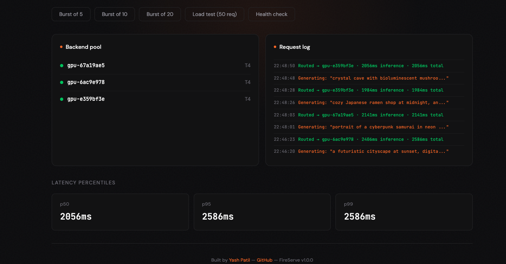
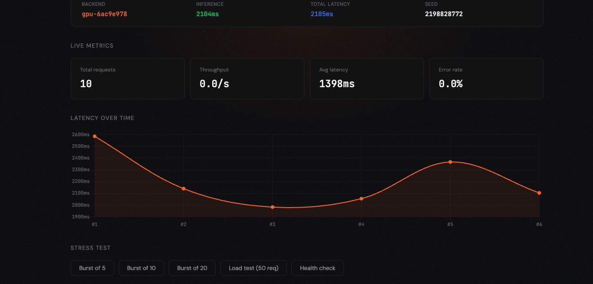
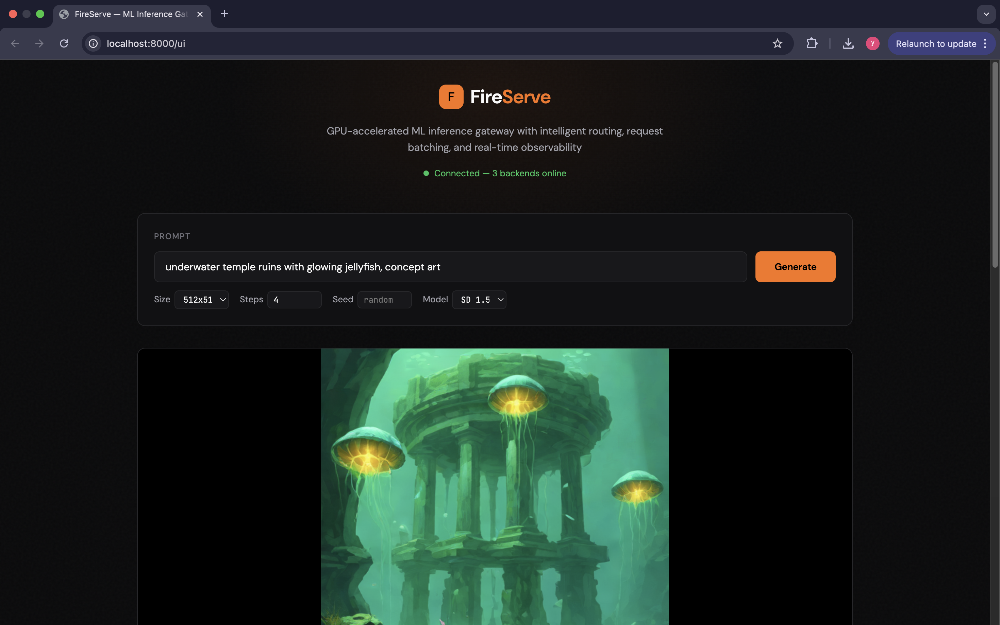

# 🔥 FireServe — GPU-Accelerated ML Inference Gateway

A production-grade API gateway for serving image generation models with intelligent request batching, health-aware routing, automatic retries, and real-time observability. Built to demonstrate the infrastructure patterns behind large-scale AI inference systems like Adobe Firefly.


---

## Demo

**Dashboard UI** — real-time inference with GPU-accelerated image generation:



**Live metrics** — latency tracking, backend pool monitoring, and stress testing:



**Backend pool** — multiple GPU backends with request routing and logging:



> Images generated on NVIDIA Tesla T4 GPU via SDXL-Turbo (fp16) with 4-step inference in ~2 seconds.

---


## Why This Exists

When serving generative AI models at scale, the hard problem isn't running inference — it's everything around it: routing requests to the right GPU, handling failures gracefully, batching requests for throughput, and monitoring performance in real time.

**FireServe** is the infrastructure layer that sits between users and GPU backends, solving these exact problems:

```
                    ┌─────────────────────────────────┐
                    │        FireServe Gateway         │
  Clients ──────►  │                                   │
                    │  ┌───────────┐  ┌─────────────┐  │      ┌──────────────┐
  POST /v1/generate │  │  Request   │  │  Health-    │  │ ───► │  GPU Backend  │
  POST /v1/batch    │  │  Batcher   │  │  Aware      │  │      │  (T4 / A100)  │
                    │  │  (50ms     │  │  Router     │  │      └──────────────┘
  GET /health       │  │  window)   │  │  (least-    │  │
  GET /metrics      │  └───────────┘  │  score)     │  │      ┌──────────────┐
                    │                  └─────────────┘  │ ───► │  GPU Backend  │
                    │  ┌───────────┐  ┌─────────────┐  │      │  (T4 / A100)  │
                    │  │  Circuit   │  │  Metrics &  │  │      └──────────────┘
                    │  │  Breaker   │  │  Prometheus │  │
                    │  │  + Retry   │  │  Export     │  │      ┌──────────────┐
                    │  └───────────┘  └─────────────┘  │ ───► │  GPU Backend  │
                    │                                   │      │  (Fallback)   │
                    └─────────────────────────────────┘      └──────────────┘
```

## Key Features

### Intelligent Request Routing
Routes each request to the optimal GPU backend using a composite scoring function that considers current latency (EMA), active request count, and available VRAM. This ensures even load distribution across heterogeneous GPU instances.

### Dynamic Request Batching
Collects incoming requests within a configurable time window (default 50ms) and groups them into batches up to 8 requests. Batching maximizes GPU utilization by reducing kernel launch overhead — critical for models like SDXL-Turbo.

### Circuit Breaker with Automatic Failover
Implements the circuit breaker pattern per-backend:
- **Closed** → requests flow normally
- **Open** → after 3 consecutive failures, backend is removed from pool for 30s
- **Half-Open** → one test request is allowed through to check recovery

Failed requests automatically retry on a different backend with exponential backoff.

### Real-Time Observability
- Latency percentiles (p50, p95, p99) via sliding window
- Throughput tracking (requests/second)
- Per-backend error rates
- Prometheus-compatible `/metrics/prometheus` endpoint for Grafana dashboards

### Production-Ready Kubernetes Deployment
Full K8s manifests and Helm chart with:
- Horizontal Pod Autoscaler scaling on CPU/memory
- Rolling updates with zero downtime
- Readiness/liveness probes
- GPU node scheduling with NVIDIA tolerations
- ConfigMap-driven configuration

---

## Quick Start

### 1. Run Locally (No GPU Required)

The gateway runs in mock mode by default — simulates realistic GPU latency for development and testing.

```bash
# Clone and install
git clone https://github.com/Yxp23/fireserve-inference-gateway.git
cd fireserve-inference-gateway
pip install -r requirements.txt

# Start the gateway
uvicorn app.main:app --reload --port 8000

# Open the dashboard
# Visit http://localhost:8000/ui in your browser

# Or test via CLI
curl -X POST http://localhost:8000/v1/generate \
  -H "Content-Type: application/json" \
  -d '{"prompt": "a futuristic cityscape at sunset"}'
```

### 2. Connect a Real GPU Backend (Google Colab)

```bash
# Open the Colab notebook in gpu_backend/FireServe_GPU_Backend.ipynb
# Enable T4 GPU runtime and run all cells
# Copy the ngrok URL, then register it:

curl -X POST "http://localhost:8000/backends/register?url=<NGROK_URL>&gpu_type=T4&vram_gb=15"
```

### 3. Deploy with Kubernetes

```bash
# Using raw manifests
kubectl apply -f k8s/

# Using Helm
helm install fireserve helm/fireserve/ \
  --set gpuBackend.enabled=true \
  --set autoscaling.enabled=true
```

### 4. Deploy with Docker

```bash
docker build -t fireserve-gateway .
docker run -p 8000:8000 fireserve-gateway
```

---

## API Reference

| Endpoint | Method | Description |
|---|---|---|
| `/v1/generate` | POST | Generate a single image |
| `/v1/generate/batch` | POST | Batch generate (up to 16) |
| `/health` | GET | Gateway + backend health status |
| `/metrics` | GET | JSON performance metrics |
| `/metrics/prometheus` | GET | Prometheus-format export |
| `/backends/register` | POST | Register a GPU backend |
| `/backends/{id}` | DELETE | Remove a backend |

### Example: Generate an Image

```bash
curl -X POST http://localhost:8000/v1/generate \
  -H "Content-Type: application/json" \
  -d '{
    "prompt": "a majestic mountain landscape, golden hour, digital art",
    "width": 512,
    "height": 512,
    "num_inference_steps": 4,
    "seed": 42
  }'
```

Response:
```json
{
  "request_id": "a1b2c3d4e5f6",
  "image_base64": "iVBORw0KGgo...",
  "model_used": "sdxl-turbo",
  "backend_id": "gpu-3f8a2b1c",
  "inference_time_ms": 187.42,
  "queue_wait_ms": 12.31,
  "total_latency_ms": 199.73,
  "seed_used": 42,
  "metadata": {
    "gpu_type": "Tesla T4",
    "backend_load": 1
  }
}
```

---

## Architecture Deep Dive

### Routing Algorithm

Backend selection uses a composite score to balance latency, load, and capacity:

```
score = avg_latency_ms + (active_requests × 50) - (vram_gb × 2)
```

The lowest-scoring backend is selected. This naturally prefers fast, idle, high-VRAM backends while distributing load as backends become busy.

### Circuit Breaker State Machine

```
         success
  ┌──────────────────┐
  │                  ▼
CLOSED ──3 fails──► OPEN ──30s timeout──► HALF-OPEN
  ▲                                          │
  └───────── success ────────────────────────┘
                     │
              fail → OPEN (reset timer)
```

### Retry Strategy

```
Request → Backend A (fail) → wait 100ms → Backend B (fail) → wait 200ms → Backend C (success) ✓
```

Exponential backoff with backend exclusion ensures retries hit different nodes.

---

## Testing

```bash
# Run all 20 tests
pytest tests/ -v

# Run specific test groups
pytest tests/ -k "TestRouting" -v
pytest tests/ -k "TestCircuitBreaker" -v
pytest tests/ -k "TestMetrics" -v
```

### Test Coverage

| Test Suite | Tests | What's Covered |
|---|---|---|
| MockInference | 3 | End-to-end request flow, batching, seed reproducibility |
| Routing | 4 | Score calculation, backend selection, exclusion |
| CircuitBreaker | 3 | Open/close transitions, half-open recovery |
| Metrics | 4 | Percentiles, error rates, Prometheus export |
| Validation | 4 | Input bounds, defaults, rejection |

---

## Load Testing

```bash
python scripts/load_test.py --url http://localhost:8000 --requests 200 --concurrency 20
```

Sample output (mock mode, M1 MacBook):
```
  RESULTS
──────────────────────────────────────────────────────
  Throughput:    142.8 req/s
  Success Rate:  200/200 (100.0%)
  Avg Latency:   138.4ms
  p50 Latency:   131.2ms
  p95 Latency:   198.7ms
  p99 Latency:   243.1ms
──────────────────────────────────────────────────────
```

---

## Project Structure

```
fireserve-inference-gateway/
├── app/
│   ├── main.py          # FastAPI application & endpoints
│   ├── gateway.py       # Core routing, batching, circuit breaker
│   ├── metrics.py       # Metrics collector with percentile tracking
│   └── models.py        # Pydantic request/response schemas
├── frontend/
│   └── index.html       # Dashboard UI (visit /ui)
├── tests/
│   └── test_gateway.py  # 20 tests across 5 test suites
├── k8s/
│   ├── deployment.yaml  # Gateway deployment with probes
│   ├── service.yaml     # ClusterIP service
│   ├── hpa.yaml         # Horizontal Pod Autoscaler
│   ├── configmap.yaml   # Environment configuration
│   └── gpu-backend.yaml # GPU backend with NVIDIA tolerations
├── helm/
│   └── fireserve/       # Helm chart for templated deployment
│       ├── Chart.yaml
│       ├── values.yaml
│       └── templates/
├── gpu_backend/
│   ├── server.py                    # GPU inference server (SDXL-Turbo)
│   └── FireServe_GPU_Backend.ipynb  # Colab notebook for free T4 GPU
├── scripts/
│   └── load_test.py     # Async load tester with benchmark output
├── monitoring/
│   └── prometheus.yml   # Prometheus scrape config
├── Dockerfile           # Multi-stage container build
├── requirements.txt
└── README.md
```

---

## Tech Stack

| Layer | Technology | Why |
|---|---|---|
| API Framework | FastAPI + Pydantic | Async-native, auto-validation, OpenAPI docs |
| HTTP Client | httpx | Async HTTP with connection pooling |
| ML Inference | PyTorch + Diffusers | SDXL-Turbo on GPU (fp16) |
| Containerization | Docker | Reproducible builds with health checks |
| Orchestration | Kubernetes + Helm | Autoscaling, rolling updates, GPU scheduling |
| Monitoring | Prometheus | Industry-standard metrics pipeline |
| Testing | pytest + pytest-asyncio | Async test support with fixtures |
| GPU Runtime | Google Colab (T4) | Free GPU for development & demo |

---

## What I Learned

Building this project deepened my understanding of:

- **ML inference at scale** — the gap between "model works in a notebook" and "model serves 1000 req/s reliably" is enormous. Batching, routing, and failure handling are the real engineering challenges.
- **Circuit breaker pattern** — preventing cascade failures in distributed systems by fast-failing when backends are unhealthy.
- **Kubernetes production patterns** — HPA autoscaling, rolling updates with zero downtime, GPU node scheduling with tolerations and node selectors.
- **Observability** — why p99 latency matters more than averages, and how sliding-window metrics give a real-time picture of system health.

---

## License

MIT
